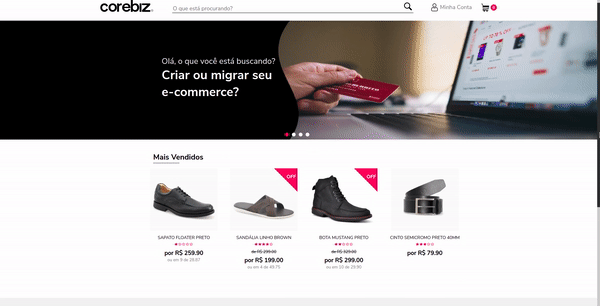

# Cor-ecommerce

## <a href="https://corecommerce.netlify.app" target="_blank" >Clique aqui para ver o projeto em ação </a>

## Descrição

Esse projeto foi desenvolvido através de um desafio da empresa Corebiz, foi passado um layout para seguir e uma API para poder consumi-lá.
Para realizar esse desafio eu utilizei as seguintes ferramentas abaixo:

## Linguagens e ferramentas utilizadas

* React
* Typescript
* Styled Components
* Context API
* Axios

## Para inicializar o projeto na sua máquina local.

<b>1º Clone esse repositório no seu computador ou baixe no formato (ZIP).</b>

<b>2º Abra o seu terminal e na raiz do projeto rode o comando `npm install` ou `yarn` para baixar todas as depêndencias do projeto.</b>

<b>3º Rode o comando "yarn start" ou "npm start".</b>

# Desenvolvido por Gustavo Scarpim:

## Desktop

## Mobile

